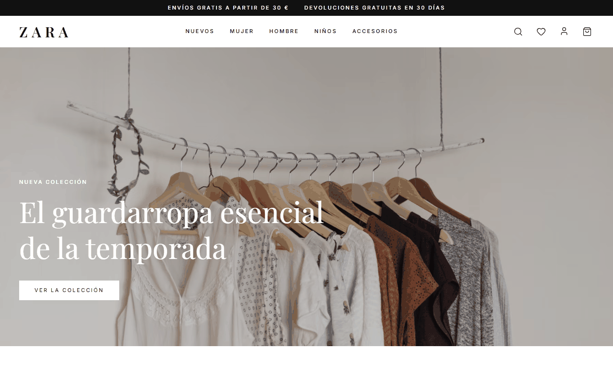
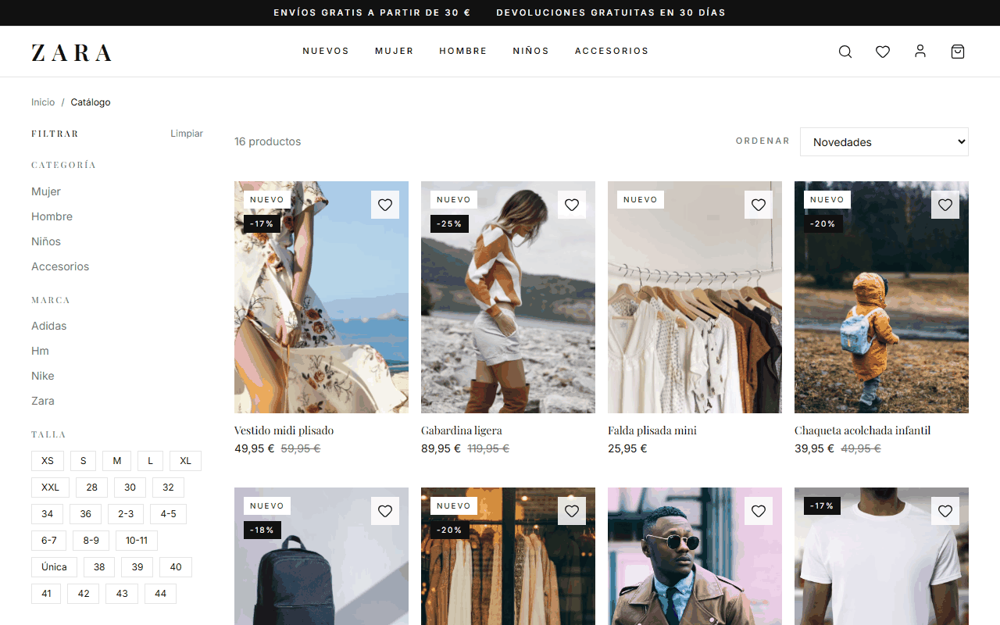
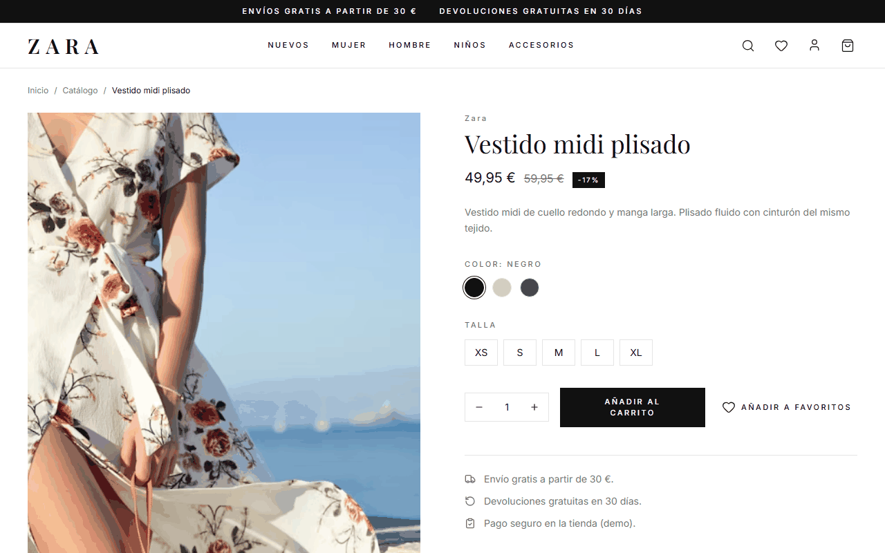
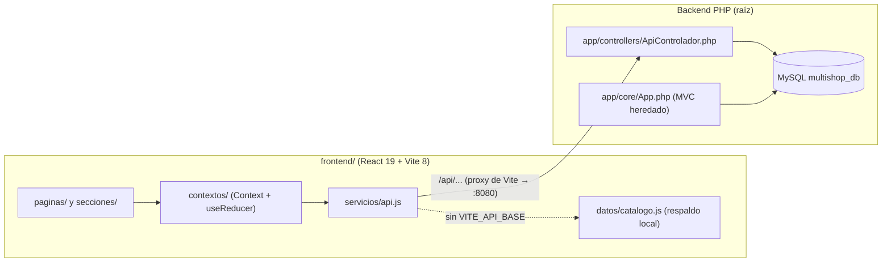

<div align="center">
  
  <h1>PaginaWebZAR</h1>
  <p><b>Tienda de moda online: SPA en React con estética editorial y una API JSON opcional sobre un backend PHP + MySQL.</b></p>
  
  
  
  
  
  
  <p>
    <a href="#-inicio-rápido">Inicio rápido</a> ·
    <a href="#-características">Características</a> ·
    <a href="#-arquitectura">Arquitectura</a> ·
    <a href="#-pruebas">Pruebas</a> ·
    <a href="#-lo-que-todavía-no-existe">Limitaciones</a>
  </p>
</div>

**PaginaWebZAR** es una tienda de moda de demostración. La interfaz activa es una SPA (`frontend/`) que funciona sola con un catálogo local de respaldo, o conectada a una API JSON escrita en PHP sobre MySQL (`multishop_db`) que persiste carrito, favoritos, sesión y pedidos. En la raíz sigue además una app **PHP MVC heredada** (plantilla Bootstrap "MultiShop") que se conserva como backend.
**No es** una tienda en producción: no hay pasarela de pago, ni panel de administración, ni afiliación con ninguna marca real (la estética imita a una tienda de moda editorial y el nombre "ZARA" del logotipo de la interfaz es solo de demostración).

## 🎬 Vista rápida

Capturas reales de la SPA en modo respaldo local (`npm run build` + `vite preview`), 1280×800:

| Inicio | Catálogo con filtros | Detalle de producto |
|:---:|:---:|:---:|
|  |  |  |

## ✨ Características

| Característica | Detalle |
|:---|:---|
| Catálogo con filtros | Filtra por categoría, marca, talla, color y rango de precio, y ordena por novedad o precio (`filtrarProductos` en `frontend/src/servicios/api.js`). 16 productos en el respaldo local. |
| Carrito, favoritos y búsqueda | Contextos con `useReducer` (`CarritoProveedor`, `FavoritosProveedor`, `BusquedaProveedor`), drawer de carrito y panel de búsqueda. |
| Cuenta de usuario | Login y registro (`CuentaProveedor`); con la API activa la contraseña se guarda con `password_hash`. |
| Checkout e historial | Páginas `Checkout` y `Pedidos`; con API activa crea `orders` + `order_items` desde el carrito de la BD. |
| Doble modo de datos | Sin `frontend/.env` usa el catálogo local; con `VITE_API_BASE` consume `/api/...` y, si falla o viene vacío, cae al respaldo local y avisa (`estaUsandoRespaldo`). |
| API JSON en PHP | `productos`, `categorias`, `marcas`, `buscar`, `carrito`, `favoritos`, `cuenta`, `pedidos` (`app/controllers/ApiControlador.php`), con consultas preparadas. |
| Accesibilidad | Gestión de foco en overlays y menús (`utils/enfoque.js`, `servicios/accesibilidad.js`). |
| Desarrollo con SDD | Constitución (`docs/constitution.md`) y 5 specs en `specs/` (tienda, datos dinámicos, checkout, pruebas, pruebas de API). |
| App PHP heredada | MVC propio (`app/core/App.php` enruta a `Inicio/Productos/Carrito/Pago/Usuario/Paginas`) sobre la plantilla Bootstrap + Owl Carousel de `public/`. |

## 🏗️ Arquitectura



<details>
<summary>Estructura de carpetas</summary>

```text
frontend/            SPA (src/componentes, contextos, datos, paginas, secciones, servicios, utils)
app/                 Backend PHP: core/, controllers/ (incluye ApiControlador), models/, views/
config/              app.php y database.php (credenciales locales)
database/            schema.sql, multishop_db.sql y migrations/002_catalogo_dinamico.sql
scripts/             migracion_catalogo.php, pruebas_api.mjs, limpiar_pruebas.php
specs/               Especificaciones SDD 001 a 005
docs/                constitution.md, assets/, screenshots/
public/              Assets de la plantilla heredada (Bootstrap, Owl Carousel)
```

</details>

## 🚀 Inicio rápido

| Requisito | Para qué |
|:---|:---|
| Node.js (probado con v24) y npm | SPA |
| PHP 8 con `pdo_mysql` y MySQL/MariaDB | Solo si quieres la API y la persistencia |

**Solo la SPA (sin backend):**

```bash
cd frontend
npm install
npm run dev          # http://localhost:5173, catálogo local de respaldo
```

<details>
<summary>Con la API PHP y MySQL (persistencia real)</summary>

1. Crea la base `multishop_db` e impórtala desde `database/multishop_db.sql`. La BD real usa columnas distintas de `database/schema.sql`; la API consulta el esquema real.
2. Ajusta `config/database.php` (por defecto host `localhost`, usuario `root`, contraseña vacía).
3. Ejecuta la migración idempotente: `php scripts/migracion_catalogo.php` (crea marcas, variantes, imágenes y un usuario demo).
4. Arranca el backend en la raíz: `php -S localhost:8080 index.php`.
5. Copia `frontend/.env.example` a `frontend/.env` (`VITE_API_BASE=` vacío activa el proxy de Vite a `:8080`) y ejecuta `npm run dev`.

No pude ejecutar estos pasos con MySQL al preparar este README; están tomados de `AGENTS.md`, los scripts y el código.

</details>

## 🧪 Pruebas

```bash
cd frontend
npm test            # node --test: 36 tests unitarios, todos pasan
npm run lint        # oxlint
npm run build       # build de producción (verificado)
npm run test:api    # integración de la API PHP: 19 pruebas, requieren PHP + MySQL
```

- Las 36 pruebas unitarias cubren reductores del carrito/favoritos, catálogo, capa `api.js`, foco y formato de precios.
- `npm run test:api` (`scripts/pruebas_api.mjs`) arranca el servidor PHP, recorre catálogo, carrito, favoritos, login y pedidos, y limpia sus datos. No se ejecutó en esta revisión (sin MySQL).
- No hay CI configurado (no existe `.github/workflows`).

## 🔒 Seguridad

- Contraseñas con `password_hash` / `password_verify`; consultas con parámetros preparados en la API.
- **Aviso:** `config/database.php` trae credenciales de desarrollo (`root` sin contraseña). Cámbialas fuera de un entorno local.
- La API no implementa protección CSRF ni limitación de intentos de login.

## 🚧 Lo que todavía no existe

- Pasarela de pagos real: el checkout solo registra el pedido.
- Panel de administración; el README anterior lo mencionaba como "próximamente".
- Autenticación, perfil y recuperación de contraseña en la app PHP heredada (la sesión real vive en la API JSON usada por la SPA).
- Documentación anterior que afirmaba controladores `HomeController`/`CheckoutController`, rutas `/auth/*`, reseñas, reportes, correos, Discord o wiki: **no existen en el código** y se retiraron.
- Sin CI, sin pruebas E2E y sin despliegue documentado.
- Dos copias de librerías en `public/lib` y `public/libs`.

## 📄 Licencia

`LICENSE.txt` es la licencia **CC BY 4.0 de la plantilla HTML de HTML Codex** en la que se basa la app PHP heredada (exige conservar la atribución). No hay licencia propia del resto del código: todos los derechos reservados por defecto. El README anterior decía "MIT", lo cual no es correcto.

<div align="center"><sub>Hecho por Luiss2080 · React, Vite y PHP</sub></div>
